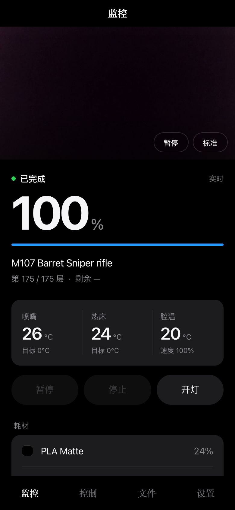

# bambu-p2s-bridge

Remote monitoring and control for a **Bambu Lab P2S** locked to **LAN Mode**, over
[Tailscale](https://tailscale.com) — with **zero public exposure** and no cloud service
in the path.



If your printer is region-locked out of Bambu Handy, or you simply don't want your
printer talking to a cloud, this gives you the phone app back on your own terms.

---

## What's here

| Piece | What it does |
|---|---|
| [`bridge/`](./bridge) | Node/TypeScript service. Speaks MQTT/FTPS to the printer, exposes a clean REST + WebSocket API with bearer auth, and proxies the camera. |
| [`app/`](./app) | uni-app (Vue 3 + TS) client. One codebase → **H5/PWA, iOS, Android, WeChat Mini Program**. |
| [`probes/`](./probes) | Dependency-free Python scripts that verify each printer protocol. Run these first. |
| [`PROTOCOL.md`](./PROTOCOL.md) | **Reverse-engineering notes for the P2S LAN protocol.** The P2S uses a new-generation state schema that existing libraries don't fully parse. |

---

## Why a bridge instead of talking to the printer directly

You *can* expose the printer's LAN with a Tailscale subnet router and skip all of this.
But then every client has to implement MQTT-over-TLS with a self-signed cert, RTSPS with
digest auth, and FTPS with TLS session reuse — on mobile, in the background, on battery.
And you still have nowhere to run push notifications from.

The bridge does that once, on a machine that's always on, and hands out a boring HTTP API.

```
Printer (LAN only)                Bridge host                    Phone
├── MQTT/TLS  :8883  ──┐          ┌──────────────────┐          ┌──────────┐
├── RTSPS     :322   ──┼─────────▶│ go2rtc (remux)   │          │          │
└── FTPS      :990   ──┘          │ bridge (API+auth)│◀────────▶│ uni-app  │
                                  │ tailscale        │ Tailscale│          │
                                  └──────────────────┘  (WG)    └──────────┘
```

---

## Key findings (details in [PROTOCOL.md](./PROTOCOL.md))

- **The camera already outputs H.264.** `rtsps://<printer>:322/streaming/live/1`,
  1080p at ~1 Mbps. No transcoding — just remux. The legacy port-6000 JPEG protocol
  used by P1/older X1 firmware is **dead on the P2S**.
- **The P2S state schema is not the X1/P1 schema.** `device.airduct`,
  `device.extruder[]`, `device.nozzle[]`, `device.ext_tool`, AMS module `n3f`.
  Chamber temperature moved to `device.ctc.info.temp` — there is no `chamber_temper`.
- **MQTT reports are deltas** and must be deep-merged, with arrays replaced wholesale.
- **FTPS requires TLS session reuse** (`522 SSL connection failed` otherwise).
  Node's `basic-ftp` handles it; Python's `ftplib` needs a subclass.

---

## Quick start

### 0. Prerequisites

- P2S in **LAN Mode** with **Developer Mode** enabled; note the 8-character Access Code
- An always-on Linux host on the same LAN (LXC container, Raspberry Pi, NAS, …)
- Tailscale on that host and on your phone

### 1. Verify your printer speaks what this expects

```bash
python3 probes/probe.py  <printer-ip> <access-code>
python3 probes/probe5.py <printer-ip> <access-code>   # camera
python3 probes/probe7.py <printer-ip> <access-code>   # files
```

No dependencies — stdlib only. If these fail, nothing else will work.

### 2. Configure

```bash
cp bridge/.env.example .env
# fill in BAMBU_HOST / BAMBU_SERIAL / BAMBU_ACCESS_CODE
# API_TOKEN: openssl rand -hex 24
chmod 600 .env
```

### 3. Run

`docker-compose.yml`:

```yaml
services:
  go2rtc:
    image: alexxit/go2rtc:latest
    restart: unless-stopped
    network_mode: host
    env_file: .env
    volumes: [./go2rtc.yaml:/config/go2rtc.yaml:ro]

  bridge:
    build: ./bridge
    restart: unless-stopped
    network_mode: host
    env_file: .env
```

`go2rtc.yaml` — note the API binds to localhost only; go2rtc has **no authentication**,
so the bridge is the only way in:

```yaml
api:  { listen: "127.0.0.1:1984" }
rtsp: { listen: "127.0.0.1:8554" }
webrtc: { listen: ":8555" }
streams:
  bambu_p2s:
    - rtsps://bblp:${BAMBU_ACCESS_CODE}@${BAMBU_HOST}:322/streaming/live/1
```

```bash
docker compose up -d --build
```

### 4. Build and host the app

```bash
cd app && npm install && npm run build:h5
cp -R dist/build/h5/. ../bridge/public/
docker compose up -d --build bridge
```

The bridge serves it at `/app/` (auth-exempt so the shell can load before you enter a
token) and redirects `/` there.

### 5. Expose over Tailscale

```bash
tailscale serve --bg --https=443 http://127.0.0.1:8080
```

You get `https://<node>.<tailnet>.ts.net` with a real Let's Encrypt certificate,
reachable only from your tailnet. **Do not enable Funnel** unless you add another
layer of auth — that publishes to the internet.

---

## API

Bearer token on everything except `/api/health` and `/app/**`.
``/WebSocket contexts can pass `?token=`.

| Method | Path | |
|---|---|---|
| `GET` | `/api/health` | Liveness (no auth) |
| `GET` | `/api/state` | Derived summary: progress, temps, AMS, lights, errors |
| `GET` | `/api/state/raw` | All 95 raw fields |
| `POST` | `/api/command` | Whitelisted commands |
| `GET` | `/api/files?path=/` | FTPS listing |
| `GET` | `/api/files/download?path=…` | Download |
| `GET` | `/api/camera/snapshot.jpg` | Single frame (authenticated proxy) |
| `GET` | `/api/camera/stream.mjpeg` | MJPEG — **triggers transcoding, use sparingly** |
| `WS` | `/api/events` | Live state push |

Commands are a closed whitelist with range validation:

```jsonc
{"type":"pause"} {"type":"resume"} {"type":"stop"}
{"type":"light","on":true}
{"type":"speed","level":2}              // 1 silent … 4 ludicrous
{"type":"nozzleTemp","celsius":220}     // capped at 300
{"type":"bedTemp","celsius":55}         // capped at 110
{"type":"home"}
{"type":"pushall"}                      // 30s cooldown
{"type":"gcode","lines":"..."}          // 403 unless ALLOW_RAW_GCODE=true
```

---

## Security model

- The printer never reaches the internet. The bridge never listens on a public interface.
- Transport is Tailscale (WireGuard) end to end. No cloud relay sees your data.
- Credentials live only in `.env` (mode 600) on the bridge host — never in the app,
  never in this repo.
- go2rtc has no auth of its own, so it is bound to `127.0.0.1` and reachable only
  through the bridge's authenticated proxy.
- `gcode_line` can drive heaters and motion. It is **off by default** and gated behind
  `ALLOW_RAW_GCODE`.

---

## Multi-platform status

| Target | Status |
|---|---|
| H5 / PWA | ✅ Works. Add to Home Screen for a native feel. |
| iOS / Android | ✅ Builds via `npm run build:app` (needs HBuilderX or DCloud cloud build). |
| WeChat Mini Program | ⚠️ **Dev/trial builds only.** |

The Mini Program limitation is platform policy, not a code problem: `wx.request` and
WebSocket both require HTTPS/WSS on an **ICP-filed domain** in production, and a
`*.ts.net` name can't be domain-verified. `live-player` additionally needs a business
qualification. Publishing for real would mean exposing the service publicly with a filed
domain — which defeats the point of the Tailscale-only design. The build target is kept
working for anyone who wants to make that trade.

---

## Status and roadmap

Working: live state, camera, pause/resume/stop, lights, temperature, speed, file browsing,
dark/light themes.

Not done yet:
- [ ] Push notifications (print complete / HMS error / offline)
- [ ] File upload + remote print start (`project_file` + AMS mapping)
- [ ] WebRTC signalling proxy — the true zero-transcode camera path
- [ ] Timelapse download in-app

---

## Compatibility

Verified on a **P2S** running `ota 01.00.05.00`. The AMS/camera/FTPS parts are likely
similar on other new-generation Bambu machines; the X1/P1 series use a different state
schema and are **not** supported by the parsing here — for those, use
[ha-bambulab](https://github.com/greghesp/ha-bambulab).

Bambu Lab has tightened LAN/Developer Mode before. This may break on firmware update.

## Credits

[OpenBambuAPI](https://github.com/Doridian/OpenBambuAPI) ·
[ha-bambulab](https://github.com/greghesp/ha-bambulab) ·
[go2rtc](https://github.com/AlexxIT/go2rtc)

## License

MIT
