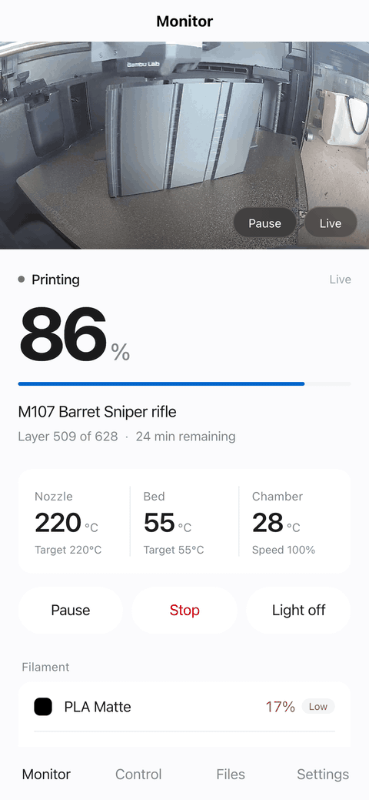
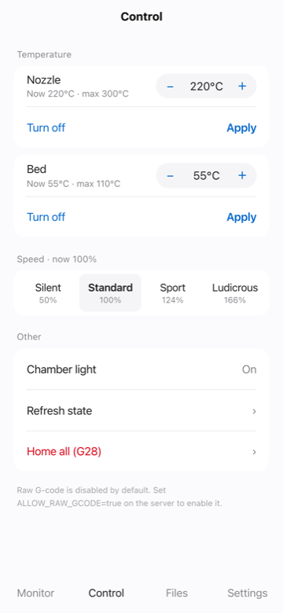
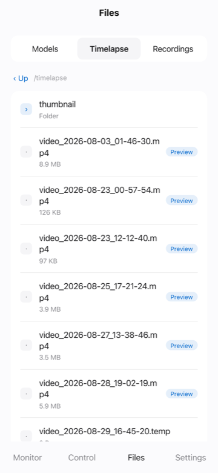
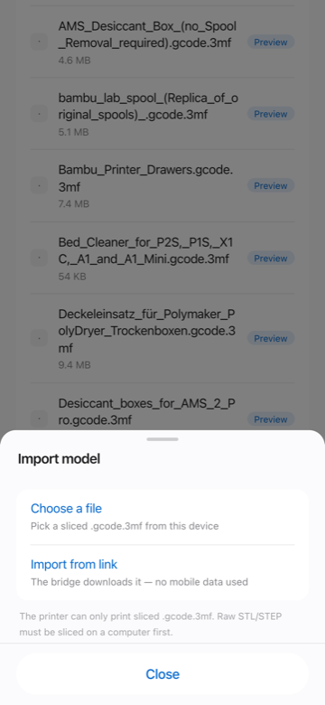
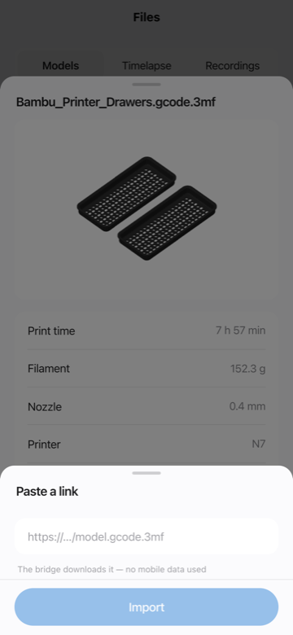
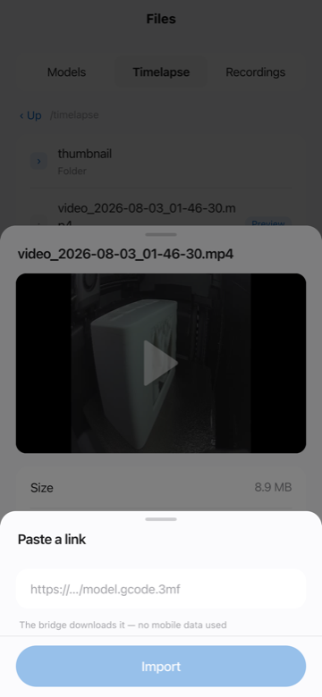

# bambu-p2s-bridge

[](https://github.com/Kevinlibaba/bambu-p2s-bridge/actions/workflows/ci.yml)

Remote monitoring and control for a **Bambu Lab P2S** locked to **LAN Mode**, over
[Tailscale](https://tailscale.com) — with **zero public exposure** and no cloud service
in the path.

<p align="center">
  
</p>

<details>
<summary>Individual screens</summary>

<table>
  <tr>
    <td width="33%"></td>
    <td width="33%"></td>
    <td width="33%"></td>
  </tr>
  <tr>
    <td align="center"><b>Monitor</b><br>Live WebRTC video, progress, temperatures, AMS</td>
    <td align="center"><b>Control</b><br>Temperature, speed, lighting</td>
    <td align="center"><b>Files</b><br>Models, timelapse, recordings</td>
  </tr>
  <tr>
    <td></td>
    <td></td>
    <td></td>
  </tr>
  <tr>
    <td align="center"><b>Import</b><br>From the device or a URL</td>
    <td align="center"><b>3MF preview</b><br>Plate render and slicer metadata</td>
    <td align="center"><b>Video playback</b><br>Seekable over ranged FTPS</td>
  </tr>
</table>

</details>

If your printer is region-locked out of Bambu Handy, or you simply don't want your
printer talking to a cloud, this gives you the phone app back on your own terms.

---

## What's here

| Piece | What it does |
|---|---|
| [`bridge/`](./bridge) | Node/TypeScript service. Speaks MQTT/FTPS to the printer, exposes a clean REST + WebSocket API with bearer auth, and proxies the camera. |
| [`app/`](./app) | Web client (uni-app / Vue 3 + TS). Builds to **H5 / PWA** — installable to the home screen. |
| [`probes/`](./probes) | Dependency-free Python scripts that verify each printer protocol. Run these first. |
| [`PROTOCOL.md`](./PROTOCOL.md) | **Reverse-engineering notes for the P2S LAN protocol.** The P2S uses a new-generation state schema that existing libraries don't fully parse. |

---

## Why a bridge instead of talking to the printer directly

You *can* expose the printer's LAN with a Tailscale subnet router and skip all of this.
But then every client has to implement MQTT-over-TLS with a self-signed cert, RTSPS with
digest auth, and FTPS with TLS session reuse — on mobile, in the background, on battery.
And you still have nowhere to run push notifications from.

The bridge does that once, on a machine that's always on, and hands out a boring HTTP API.

```
Printer (LAN only)                Bridge host                    Phone
├── MQTT/TLS  :8883  ──┐          ┌──────────────────┐          ┌──────────┐
├── RTSPS     :322   ──┼─────────▶│ go2rtc (remux)   │          │          │
└── FTPS      :990   ──┘          │ bridge (API+auth)│◀────────▶│ uni-app  │
                                  │ tailscale        │ Tailscale│          │
                                  └──────────────────┘  (WG)    └──────────┘
```

---

## Key findings (details in [PROTOCOL.md](./PROTOCOL.md))

- **The camera already outputs H.264.** `rtsps://<printer>:322/streaming/live/1`,
  1080p at ~1 Mbps. No transcoding — just remux. The legacy port-6000 JPEG protocol
  used by P1/older X1 firmware is **dead on the P2S**.
- **The P2S state schema is not the X1/P1 schema.** `device.airduct`,
  `device.extruder[]`, `device.nozzle[]`, `device.ext_tool`, AMS module `n3f`.
  Chamber temperature moved to `device.ctc.info.temp` — there is no `chamber_temper`.
- **MQTT reports are deltas** and must be deep-merged, with arrays replaced wholesale.
- **FTPS requires TLS session reuse** (`522 SSL connection failed` otherwise).
  Node's `basic-ftp` handles it; Python's `ftplib` needs a subclass.

---

## Quick start

### 0. Prerequisites

- P2S in **LAN Mode** with **Developer Mode** enabled; note the 8-character Access Code
- An always-on Linux host on the same LAN (LXC container, Raspberry Pi, NAS, …)
- Tailscale on that host and on your phone

### 1. Verify your printer speaks what this expects

```bash
python3 probes/probe.py  <printer-ip> <access-code>
python3 probes/probe5.py <printer-ip> <access-code>   # camera
python3 probes/probe7.py <printer-ip> <access-code>   # files
```

No dependencies — stdlib only. If these fail, nothing else will work.

### 2. Configure

```bash
cp bridge/.env.example .env
# fill in BAMBU_HOST / BAMBU_SERIAL / BAMBU_ACCESS_CODE
# API_TOKEN: openssl rand -hex 24
chmod 600 .env
```

### 3. Run

`docker-compose.yml`:

```yaml
services:
  go2rtc:
    image: alexxit/go2rtc:latest
    restart: unless-stopped
    network_mode: host
    env_file: .env
    volumes: [./go2rtc.yaml:/config/go2rtc.yaml:ro]

  bridge:
    build: ./bridge
    restart: unless-stopped
    network_mode: host
    env_file: .env
```

`go2rtc.yaml` — note the API binds to localhost only; go2rtc has **no authentication**,
so the bridge is the only way in:

```yaml
api:  { listen: "127.0.0.1:1984" }
rtsp: { listen: "127.0.0.1:8554" }
webrtc: { listen: ":8555" }
streams:
  bambu_p2s:
    - rtsps://bblp:${BAMBU_ACCESS_CODE}@${BAMBU_HOST}:322/streaming/live/1
```

```bash
docker compose up -d --build
```

### 4. Build and host the app

```bash
cd app && npm install && npm run build:h5
cp -R dist/build/h5/. ../bridge/public/
docker compose up -d --build bridge
```

The bridge serves it at `/app/` (auth-exempt so the shell can load before you enter a
token) and redirects `/` there.

### 5. Expose over Tailscale

```bash
tailscale serve --bg --https=443 http://127.0.0.1:8080
```

You get `https://<node>.<tailnet>.ts.net` with a real Let's Encrypt certificate,
reachable only from your tailnet. **Do not enable Funnel** unless you add another
layer of auth — that publishes to the internet.

---

## API

Bearer token on everything except `/api/health` and `/app/**`.
``/WebSocket contexts can pass `?token=`.

| Method | Path | |
|---|---|---|
| `GET` | `/api/health` | Liveness (no auth) |
| `GET` | `/api/state` | Derived summary: progress, temps, AMS, lights, errors |
| `GET` | `/api/state/raw` | All 95 raw fields |
| `POST` | `/api/command` | Whitelisted commands |
| `GET` | `/api/files?path=/` | FTPS listing |
| `GET` | `/api/files/stream?path=…` | Stream a file inline — **HTTP Range / `206`**, for `<video>` |
| `GET` | `/api/files/download?path=…` | Same bytes, `Content-Disposition: attachment` |
| `GET` | `/api/files/3mf?path=…` | `.gcode.3mf` metadata — per-plate time, filament, objects |
| `GET` | `/api/files/3mf/plate.png?path=…&plate=1` | Plate preview extracted from inside the 3MF |
| `GET` | `/api/camera/snapshot.jpg` | Single frame (authenticated proxy) |
| `WS` | `/api/camera/ws` | WebRTC signalling, proxied to go2rtc with auth |
| `POST` | `/api/files/upload` | Import a sliced 3MF (streamed multipart) |
| `POST` | `/api/files/import` | Import from a URL — the bridge fetches it |
| `DELETE` | `/api/files?path=…` | Delete a file |
| `POST` | `/api/print/start` | Start a print from a file already on the card |
| `WS` | `/api/events` | Live state push |

`/api/files/stream` and `/api/files/download` both honour `Range` and answer `206
Partial Content` with `Content-Range` / `Accept-Ranges` / an exact `Content-Length`,
so a `<video>` element can seek. FTP has no way to stop a transfer mid-flight, so the
bridge counts bytes on the way out and destroys the FTP connection once the requested
range is satisfied — including when the phone walks away. Concurrent reads are capped
(one FTP connection per range request; the printer does not have many to give).

`/api/files/3mf*` reads the ZIP central directory over `REST` and pulls out only the
entries it needs. A whole 3MF is never shipped to the phone, and never fully buffered
on the bridge.

Commands are a closed whitelist with range validation:

```jsonc
{"type":"pause"} {"type":"resume"} {"type":"stop"}
{"type":"light","on":true}
{"type":"speed","level":2}              // 1 silent … 4 ludicrous
{"type":"nozzleTemp","celsius":220}     // capped at 300
{"type":"bedTemp","celsius":55}         // capped at 110
{"type":"home"}
{"type":"pushall"}                      // 30s cooldown
{"type":"gcode","lines":"..."}          // 403 unless ALLOW_RAW_GCODE=true
```

---

### Camera

The printer emits H.264 already, so go2rtc republishes it over WebRTC without
re-encoding: full frame rate at the same ~1 Mbps the source uses. Measured on a
phone-sized viewport: **1920×1080 at 30 fps, no dropped frames**.

Only signalling passes through the bridge — `/api/camera/ws` relays to go2rtc's
WebSocket behind the same bearer token. Media goes straight from go2rtc to the
client over the tailnet, so video never touches Node's event loop.

If WebRTC cannot establish within 8 seconds the app falls back to polling single
frames, which is also the explicit "data saver" mode.

> An MJPEG endpoint used to be listed here. It never worked: go2rtc has no
> transcoder in this image, so `H264 => JPEG` fails outright. Removed rather
> than fixed — transcoding to MJPEG would cost 5–10× the bandwidth of the
> WebRTC path for worse quality.

### Importing and printing

`POST /api/files/upload` streams multipart straight through to the printer's FTPS —
a 35 MB slice is never held in memory. After the write the file is re-opened over
ranged reads and validated as a real 3MF; anything that fails is deleted again, so a
renamed `.txt` cannot sit on the card pretending to be a model. `/api/files/import`
takes a URL and does the same, with the bridge doing the fetching — on a wired link
that is a lot faster than pushing 35 MB up from a phone.

`POST /api/print/start` is the only endpoint that makes the machine heat and move,
so the checks are server-side rather than trusted from the client: the file must
already be on the card, it must parse as a 3MF, the requested plate must exist, the
AMS mapping must be integers, and the printer must not already be printing. The app
adds a confirmation that spells out what is about to happen.

> ⚠️ The `project_file` payload follows the documented X1/P1 shape. It has **not been
> verified end to end on a P2S** — doing so means starting a real print. Supervise the
> first one.

## Security model

- The printer never reaches the internet. The bridge never listens on a public interface.
- Transport is Tailscale (WireGuard) end to end. No cloud relay sees your data.
- Credentials live only in `.env` (mode 600) on the bridge host — never in the app,
  never in this repo.
- go2rtc has no auth of its own, so it is bound to `127.0.0.1` and reachable only
  through the bridge's authenticated proxy.
- `gcode_line` can drive heaters and motion. It is **off by default** and gated behind
  `ALLOW_RAW_GCODE`.

---

## About the app

The client is a **web app (H5 / PWA)**. Open it in a browser on your phone and use
*Add to Home Screen* — it runs full-screen with no browser chrome, which is close
enough to native for a monitoring tool.

It is built with [uni-app](https://uniapp.dcloud.io) rather than plain Vue because
native iOS/Android and Mini Program targets are on the roadmap and uni-app compiles
the same source to all of them. Only the H5 target is published today; the others
are not shipped until they have been validated on real devices.

## Status and roadmap

Working: live state, camera, pause/resume/stop, lights, temperature, speed, file browsing,
in-app timelapse/recording playback, 3MF plate preview, dark/light themes.

Also working: importing sliced `.gcode.3mf` from the phone or from a URL, deleting
files, and starting a print remotely (gated — see below).

Not done yet:
- [ ] Native iOS / Android builds
- [ ] Push notifications (print complete / HMS error / offline)
- [ ] WebRTC signalling proxy — the true zero-transcode camera path
- [ ] 3D mesh viewer for `3D/3dmodel.model` — deliberately skipped, see below

### Why there is no mesh viewer

The 3MF preview shows the plate render that Bambu Studio already baked into the file,
plus the figures parsed from `Metadata/slice_info.config`. That is a few hundred KB and
works on every uni-app target.

An actual mesh viewer would mean three.js plus an XML mesh parser, a WebGL canvas that
only exists on the H5 target, and shipping megabytes of triangles to a phone — to show
the same object the baked render already shows, minus the toolpath. It was not worth the
weight. If it ever lands it should be lazy-loaded so it costs nothing when unused.

---

## Compatibility

Verified on a **P2S** running `ota 01.00.05.00`. The AMS/camera/FTPS parts are likely
similar on other new-generation Bambu machines; the X1/P1 series use a different state
schema and are **not** supported by the parsing here — for those, use
[ha-bambulab](https://github.com/greghesp/ha-bambulab).

Bambu Lab has tightened LAN/Developer Mode before. This may break on firmware update.

## Credits

[OpenBambuAPI](https://github.com/Doridian/OpenBambuAPI) ·
[ha-bambulab](https://github.com/greghesp/ha-bambulab) ·
[go2rtc](https://github.com/AlexxIT/go2rtc)

## License

MIT
