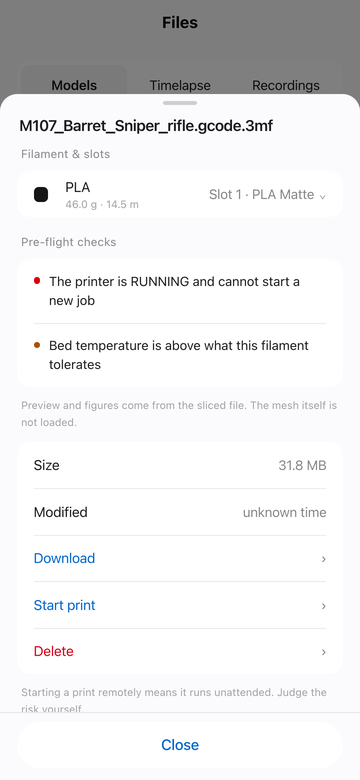
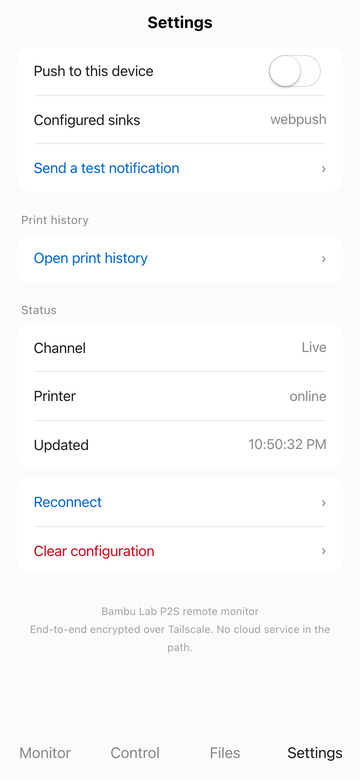

# bambu-p2s-bridge

[](https://github.com/Kevinlibaba/bambu-p2s-bridge/actions/workflows/ci.yml)

给锁在**局域网模式**下的 **Bambu Lab P2S** 做的远程监控与控制，全程走
[Tailscale](https://tailscale.com)，**零公网暴露**，链路上没有任何云服务。

[English](./README.md)

<p align="center">
  
</p>

<details>
<summary>逐屏查看</summary>

<table>
  <tr>
    <td width="33%"></td>
    <td width="33%"></td>
    <td width="33%"></td>
  </tr>
  <tr>
    <td align="center"><sub>监控</sub></td>
    <td align="center"><sub>控制</sub></td>
    <td align="center"><sub>文件</sub></td>
  </tr>
  <tr>
    <td></td>
    <td></td>
    <td></td>
  </tr>
  <tr>
    <td align="center"><sub>打印前自检与逐耗材选料盘</sub></td>
    <td align="center"><sub>打印历史</sub></td>
    <td align="center"><sub>推送通知</sub></td>
  </tr>
</table>

</details>

如果你的打印机因为锁区用不了 Bambu Handy，或者你单纯不想让打印机连云，
这个项目让你按自己的方式把手机端拿回来。

---

## 项目构成

| 目录 | 作用 |
|---|---|
| [`bridge/`](./bridge) | Node/TypeScript 桥接服务。对打印机说 MQTT/FTPS，对外暴露带鉴权的 REST + WebSocket API，并代理摄像头。 |
| [`app/`](./app) | 网页客户端（uni-app / Vue 3 + TS），构建为 **H5 / PWA**，可添加到主屏幕。 |
| [`install.sh`](./install.sh) | 一键部署：发现打印机、生成密钥、构建、启动、自检。 |
| [`probes/`](./probes) | 零依赖的 Python 协议探针。**先跑这个**。 |
| [`PROTOCOL.md`](./PROTOCOL.md) | **P2S 局域网协议逆向笔记。** P2S 用的是新一代状态 schema，现有库解析不全。 |

---

## 为什么要做桥接，而不是让手机直连打印机

你确实可以用 Tailscale 子网路由把局域网整个打通，跳过这一切。但那样每个客户端都得
自己实现：自签证书的 MQTT over TLS、Digest 认证的 RTSPS、要求 TLS session 复用的
FTPS —— 还得在手机上、在后台、靠电池跑。而且推送通知没有地方发。

桥接服务把这些做一次，跑在一台常开的机器上，对外只给一个平平无奇的 HTTP API。

---

## 关键发现（详见 [PROTOCOL.md](./PROTOCOL.md)）

- **摄像头本来就输出 H.264。** `rtsps://<打印机>:322/streaming/live/1`，1080p 约 1 Mbps。
  不需要转码，remux 即可。P1/老 X1 固件用的 6000 端口私有 JPEG 协议在 **P2S 上已失效**。
- **P2S 的状态 schema 不是 X1/P1 那套。** 多了 `device.airduct`、`device.extruder[]`、
  `device.nozzle[]`、`device.ext_tool`，AMS 模块名 `n3f`。
  **腔温挪到了 `device.ctc.info.temp`，没有 `chamber_temper` 字段。**
- **MQTT 上报是增量的**，必须深合并，且数组要整体替换。
- **FTPS 要求 TLS session 复用**（否则报 `522 SSL connection failed`）。
  Node 的 `basic-ftp` 自动处理；Python 的 `ftplib` 需要自己继承改写。

---

## 快速开始

### 前提

- P2S 处于**局域网模式**且已开启**开发者模式** —— 记下那串 8 位访问码
- 一台与打印机同局域网、常年在线的 Linux 机器（LXC、树莓派、NAS 均可），装好
  **Docker** 与 Compose 插件
- 可选：这台机器和手机上都装 Tailscale，用于从外网访问

### 一条命令

```bash
git clone https://github.com/Kevinlibaba/bambu-p2s-bridge.git
cd bambu-p2s-bridge
./install.sh
```

它会通过 SSDP 找到打印机、问你要访问码、生成 API Token 与 Web Push 密钥、
构建两个镜像并启动，最后**确认真的能和打印机通上**再告诉你成功，
并把手机上要填的地址和 Token 打出来。

宿主机**不需要**装 Node —— 前端在镜像里构建。

重复执行是安全的：它会问你要不要沿用现有的 `.env`，只重新构建。

非交互：

```bash
BAMBU_ACCESS_CODE=xxxxxxxx ./install.sh --yes --no-tailscale
```

### 先体检（可选）

出问题时，这几个脚本能告诉你是哪一层协议不通。只用标准库。

```bash
python3 scripts/discover.py                           # 找局域网里的打印机
python3 probes/probe.py  <打印机IP> <访问码>          # MQTT
python3 probes/probe5.py <打印机IP> <访问码>          # 摄像头
python3 probes/probe7.py <打印机IP> <访问码>          # 文件
```

### 通过 Tailscale 对外暴露

宿主机装了 `tailscale` 的话 `install.sh` 会问你要不要顺手配好。手动：

```bash
tailscale serve --bg --https=443 http://127.0.0.1:8080
```

你会得到 `https://<节点>.<tailnet>.ts.net`，带正式的 Let's Encrypt 证书，
且只有自己的 tailnet 能访问。**不要开 Funnel** —— 那是发布到公网，
除非你自己再加一层鉴权。

<details>
<summary>手动部署</summary>

```bash
cp bridge/.env.example .env
# 填 BAMBU_HOST / BAMBU_SERIAL / BAMBU_ACCESS_CODE
# API_TOKEN 用 openssl rand -hex 24 生成
# Web Push 密钥（可选）：npx web-push generate-vapid-keys
chmod 600 .env
mkdir -p data

docker compose up -d --build
```

`docker-compose.yml` 与 `go2rtc.yaml` 都在仓库里。go2rtc 的 API 只监听回环地址 ——
它自身没有任何鉴权，桥接是唯一入口，切勿改成 `0.0.0.0`。

桥接把前端挂在 `/app/`（免鉴权，否则还没填 Token 时页面都加载不出来），
并把 `/` 重定向过去。`./data` 存放推送订阅与打印历史，容器重建时必须保留。

</details>

## 摄像头

打印机本身输出 H.264，go2rtc 原样转发成 WebRTC，不重新编码：全帧率，带宽仍是源流的
约 1 Mbps。实测（手机尺寸视口）：**1920×1080、30 fps、零丢帧**。

只有信令经过桥接——`/api/camera/ws` 用同一个 Bearer token 鉴权后中继到 go2rtc 的
WebSocket；媒体由 go2rtc 直接发给客户端，视频数据完全不进 Node 的事件循环。

WebRTC 8 秒内建立不起来会自动退回抽帧，这也是显式的「省流」档。

> 这里原本列过一个 MJPEG 端点，它从来没工作过：镜像里没有转码器，
> `H264 => JPEG` 直接失败。选择删除而不是修复——转成 MJPEG 同画质要花
> WebRTC 5–10 倍的带宽。

## 导入与打印

`POST /api/files/upload` 把 multipart 流直接转给打印机的 FTPS，35MB 的切片文件全程不进内存。
写完后再用分段读取把它当作 3MF 重新解析一遍，校验不过就删掉——改名的 `.txt` 没法伪装成模型留在卡上。
`/api/files/import` 接收链接、由桥接去下载，有线千兆比手机上行快得多。

`POST /api/print/start` 是唯一会让机器加热并运动的接口，校验全部放在服务端而不是信任客户端：
文件必须已在卡上、必须能解析为 3MF、请求的盘必须存在、AMS 映射必须是整数、打印机必须不在打印中。
App 侧还有一层写明后果的二次确认。

> ⚠️ `project_file` 的参数沿用 X1/P1 的公开格式，**尚未在 P2S 上端到端验证过**——
> 验证意味着真的开一次打印。首次使用请在旁看管。

## 安全设计

- 打印机永远不出网，桥接服务不监听公网接口。
- 传输走 Tailscale（WireGuard）端到端，没有云中转看得到你的数据。
- 凭据只存桥接主机的 `.env`（600 权限），不进 App，不进本仓库。
- go2rtc 自身没有鉴权，因此只监听 `127.0.0.1`，只能经桥接服务的鉴权代理访问。
- `gcode_line` 能直接驱动加热和运动，**默认关闭**，由 `ALLOW_RAW_GCODE` 控制。

---

## 关于客户端

客户端是**网页版（H5 / PWA）**。手机浏览器打开后「添加到主屏幕」，即可全屏无地址栏运行，
对一个监控类工具来说观感已经接近原生。

之所以用 [uni-app](https://uniapp.dcloud.io) 而不是纯 Vue，是因为原生 iOS/Android
与小程序在路线图上，uni-app 能用同一份源码编译到这些平台。**当前只发布 H5 目标**，
其余端在真机验证之前不随仓库发布。

## 进度

已完成：实时状态、摄像头、暂停/继续/停止、灯光、温度、速度、文件浏览、
App 内播放延时摄影与录像、3MF 盘面预览、深浅色主题。

另已完成：从手机或链接导入已切片的 `.gcode.3mf`、删除文件、远程启动打印（有严格限制，见下）。

待办：
- [ ] 打印中跳过某个零件 —— 协议已摸清（[§2.6](./PROTOCOL.md#26-skipping-an-object-mid-print)），真机验证要牺牲一个零件
- [ ] 原生 iOS / Android 构建
- [ ] 推送通知（打印完成 / HMS 报错 / 离线）
- [ ] WebRTC 信令代理 —— 真正的零转码视频链路
- [ ] `3D/3dmodel.model` 网格查看器 —— 有意不做，理由见下

### 为什么不做网格查看器

3MF 预览显示的是切片时就烘焙进包里的盘面渲染图，加上 `Metadata/slice_info.config`
里解析出的数据。几百 KB，所有 uni-app 目标端都能用。

真做网格查看器意味着 three.js 加一个 XML 网格解析器、一块只有 H5 端才有的 WebGL
画布，还要把几 MB 三角面推到手机上 —— 换来的画面与那张烘焙渲染图看到的是同一个
物体，只是少了工具路径。不值这个体积。真要做，也应当懒加载，不用时零成本。

---

## 兼容性

在 **P2S / 固件 `ota 01.00.05.00`** 上验证。其他新一代 Bambu 机型可能相近；
**X1/P1 系列 schema 不同，本项目的解析不适用**，那些机型请用
[ha-bambulab](https://github.com/greghesp/ha-bambulab)。

Bambu Lab 多次收紧过局域网/开发者模式，固件升级可能导致失效。

## 致谢

[OpenBambuAPI](https://github.com/Doridian/OpenBambuAPI) ·
[ha-bambulab](https://github.com/greghesp/ha-bambulab) ·
[go2rtc](https://github.com/AlexxIT/go2rtc)

## 许可

MIT
